# Deep Hashing with Semantic Hash Centers for Image Retrieval

## Overview
This repository is the PyTorch implementation of ACM MM 2024 (CCF A) paper: "SHC: Deep Hashing with Semantic Hash Centers for Image Retrieval".

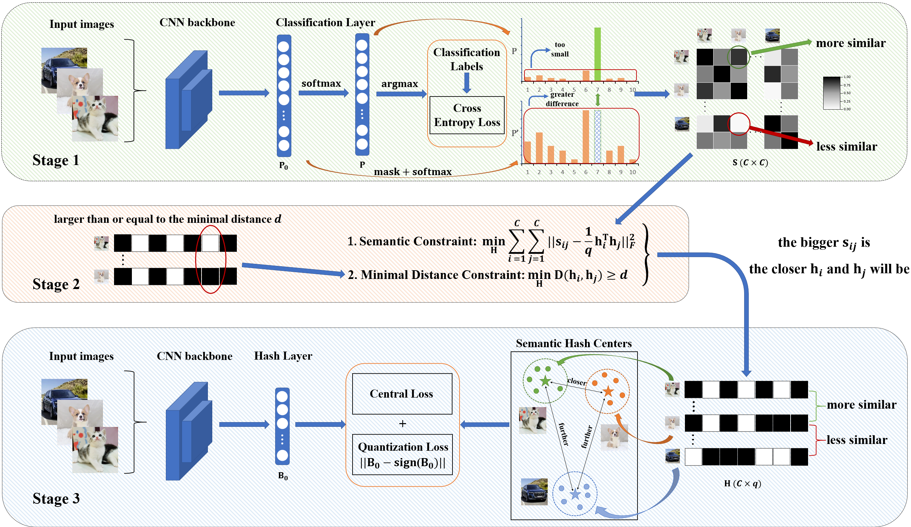

**SHC** is a three-stage framework designed to generate hash codes that accurately preserve semantic information, significantly enhancing large-scale image retrieval performance.

### Core Workflow
<ol>
  <li><strong>Semantic Similarity Detection</strong>: Construct a classification network to identify semantic relationships between classes, and adopt a data-dependent similarity calculation method that flexibly adapts to different data distribution characteristics.</li>
  <li><strong>Semantic Hash Center Generation</strong>: Propose a new optimization algorithm that maintains the semantic relevance of hash centers while ensuring a minimum distance between them through distance constraints. This effectively addresses the issue of degraded retrieval performance caused by excessively close hash centers.</li>
  <li><strong>Deep Hashing Network Training</strong>: Train a deep hashing network based on the generated semantic hash centers to efficiently convert images into binary hash codes.</li>
</ol>


### Experimental Results
Experiments on large-scale image retrieval across several public datasets demonstrate that the hash codes generated by SHC have stronger discriminative power, significantly improving retrieval accuracy and efficiency.​
Feel free to explore the implementation details in the code repository or conduct secondary development based on this framework!

## Catalogue

- [Getting Started](#getting-started)
- [Code Introduction](#code-introduction)
- [Dataset](#dataset)
- [Train](#train)
- [Precision Recall Curve](#precision-recall-curve)
- [Citation](#citation)
- [Contact](#contact)

## Getting Started
1. Clone this repository:
```
git clone https://Deep-Hashing-with-Semantic-Hash-Centers-for-Image-Retrieval.git
cd Deep-Hashing-with-Semantic-Hash-Centers-for-Image-Retrieval
```

2. Create a conda environment and install the dependencies:
```
conda create -n SHC python=3.10.0
conda activate SHC
pip install torch==2.1.2 torchvision==0.16.2 torchaudio==2.1.0 --index-url https://download.pytorch.org/whl/cu121
```

## Code Introduction
- `GenerateSimilarityMatrix.py` is stage1 in SHC, you can easily use it to generate SimilarityMatrix on your own dataset.
- `GenerateSemanticHashCenters.py` is stage2 in SHC, you can generate SemanticHashCenters based on SimilarityMatrix.
- `network.py` contains all the networks used in SHC, including classification network and hash network. The default is ResNet34. If you need to modify the backbone, you can do so here.

## Dataset
We have utilized six datasets: CIFAR-100, Stanford Cars-A, Stanford Cars-B, NABirds-A, NABirds-B, and MSCOCO.
You can choose the dataset you want to use by
```
python run.py --dataset xxx
```
You can download all the datasets from the following links.

  | *Dataset*        | *Link*                                                  |
  | ---------------- | ------------------------------------------------------- |
  | CIFAR-100        | [Link](https://pan.baidu.com/s/1UWk08uj8kN0lNLojkkLrDQ?pwd=ctus) |
  | Stanhford Cars-A | [Link](https://pan.baidu.com/s/1TqhOi0xJOj9_GatSSborTg?pwd=u4tg) |
  | Stanhford Cars-B | [Link](https://pan.baidu.com/s/1qXncecYm2mqwFzo5BOW_9w?pwd=x783) |
  | NABirds-A        | [Link](https://pan.baidu.com/s/1T8D00R1FE-hbCtfdiGwbwQ?pwd=h7sq) |
  | NABirds-B        | [Link](https://pan.baidu.com/s/1zHKDMzee_u-v1w3HkzWkAA?pwd=62p3) |
  | MSCOCO           | [Link](https://pan.baidu.com/s/1dK04HGz1rcmxOK_25yA6Mw?pwd=x8ny) |

If you want to create a custom dataset, please follow the data formats of the Stanford Cars and NABirds datasets.

## Train
You can easily train and test SHC just by
```
python run.py --dataset NAbirds-official-seg \
              --num_classes 100 \
              --code_length 32 \
              --lr 1e-4 \
              --epoch 100 \
              --classify_epoch 100 \
              --test_map 5 \
              --beta 1.00 \
              --lambd 1e-4 \
              --topk 100 \
              --batch-size 64 \
              --gpu 0
```

  Options:
  
  - `--dataset`: dataset name
  - `--num_classes`: number of dataset categories
  - `--code_length`: code length of hash.
  - `--lr`: learning rate.
  - `--epoch`: training epochs of the hashing network in stage 3.
  - `--classify_epoch`: training epochs of the classification network in stage 1.
  - `--beta`: hyperparameters.
  - `--lambd`: hyperparameters.
  - `--topk`: the topk number of retrieval images
  - `--batch_size`: the number of videos in a batch.
  - `--gpu`: choose the gpu to use.

## Precision Recall Curve
the Precision Recall Curve in SHC is here:
| 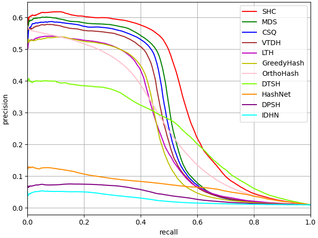 | 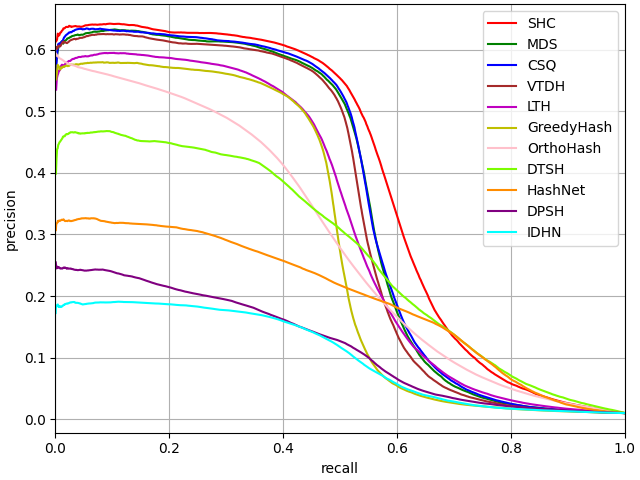 | 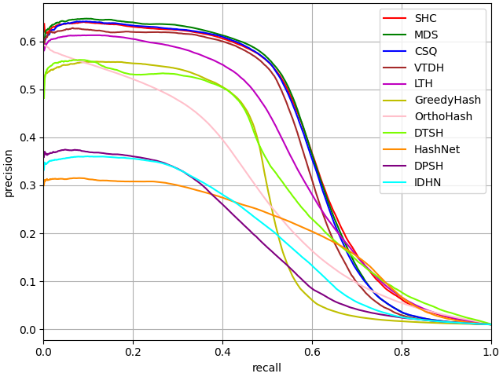 |
|:--------------------:|:--------------------:|:--------------------:|
|        16 bits, CIFAR-100        |        32 bits, CIFAR-100        |        64 bits, CIFAR-100        |

| 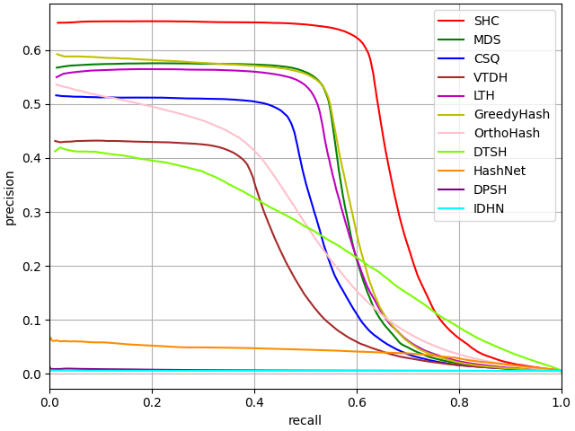 | 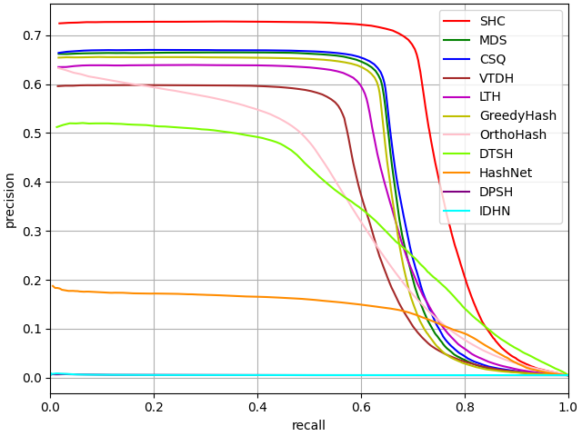 | 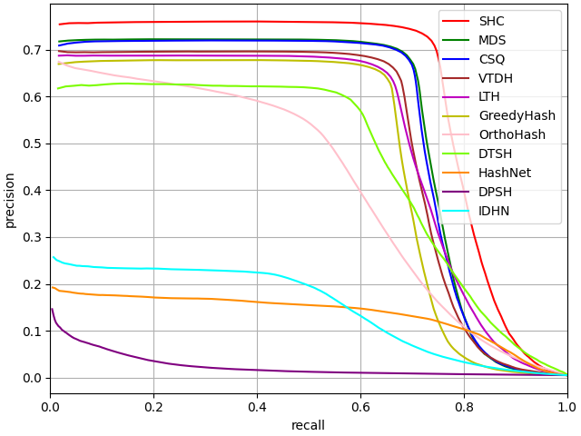 |
|:--------------------:|:--------------------:|:--------------------:|
|        16 bits, Stanford Cars-A        |        32 bits, Stanford Cars-A        |        64 bits, Stanford Cars-A        |

| 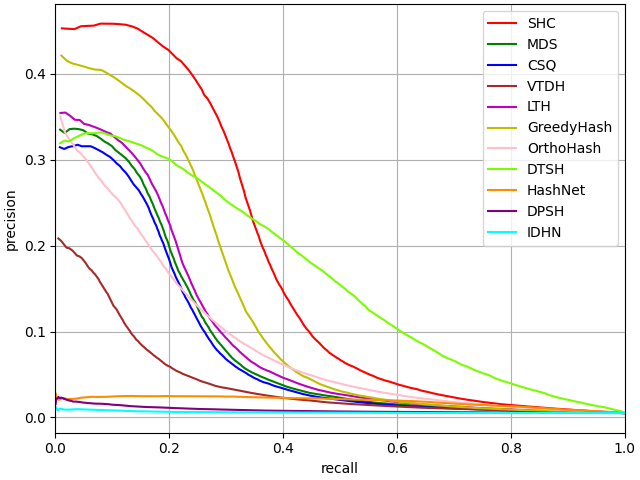 | 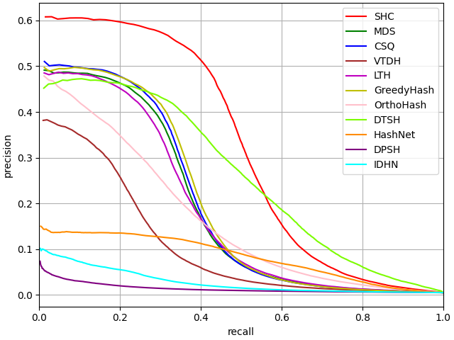 | 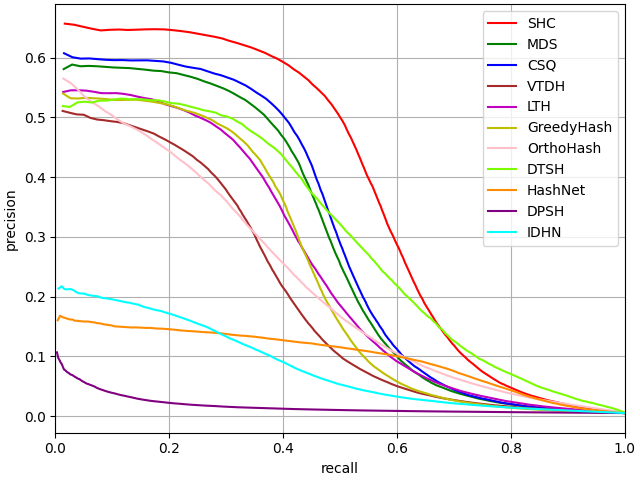 |
|:--------------------:|:--------------------:|:--------------------:|
|        16 bits, Stanford Cars-B        |        32 bits, Stanford Cars-B        |        64 bits, Stanford Cars-B        |

| 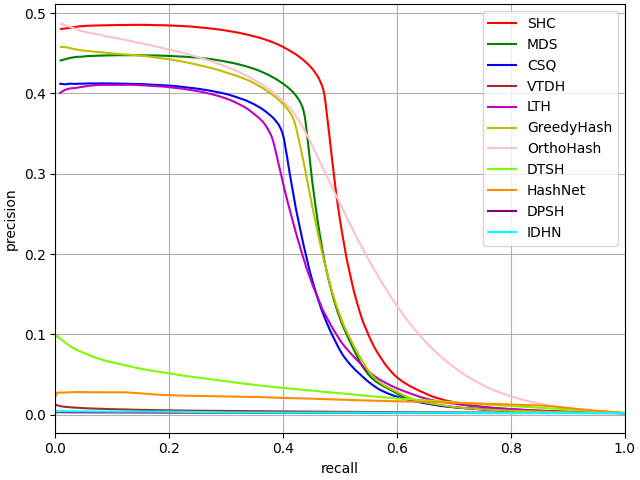 | 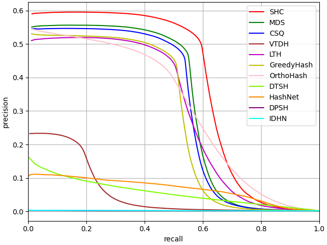 | 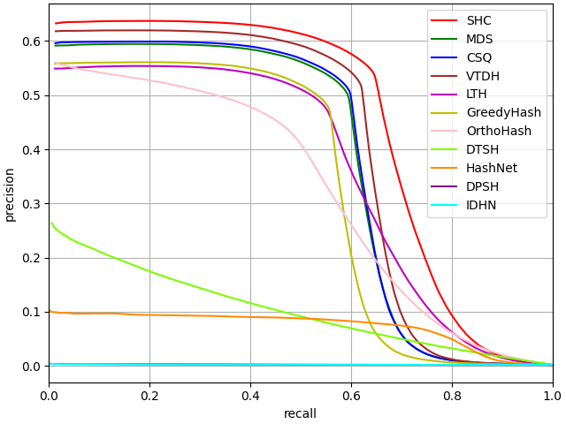 |
|:--------------------:|:--------------------:|:--------------------:|
|        16 bits, NABirds-A        |        32 bits, NABirds-A        |        64 bits, NABirds-A        |

| 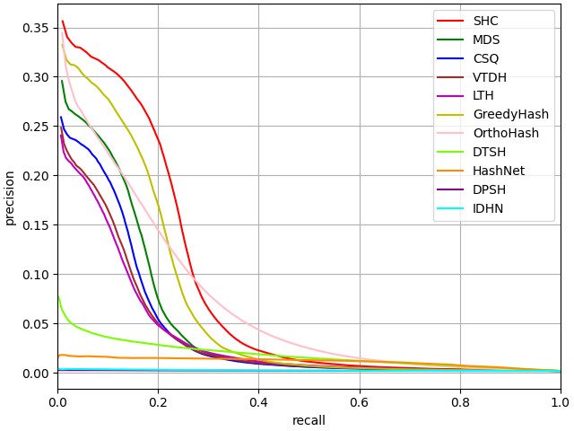 | 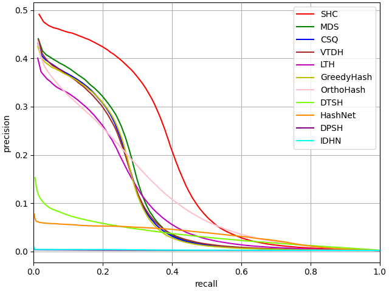 |  |
|:--------------------:|:--------------------:|:--------------------:|
|        16 bits, NABirds-B        |        32 bits, NABirds-B        |        64 bits, NABirds-B        |

| 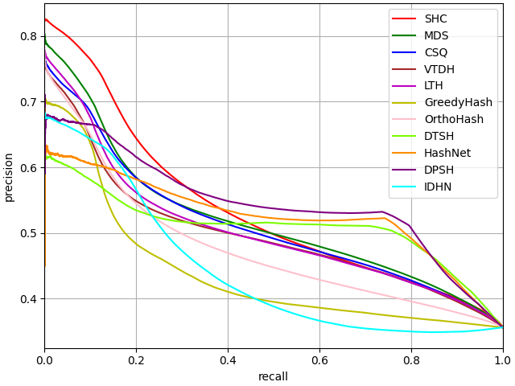 | 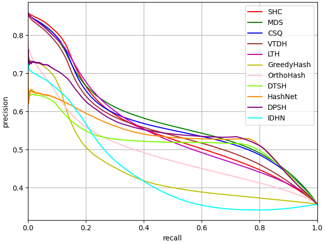 | 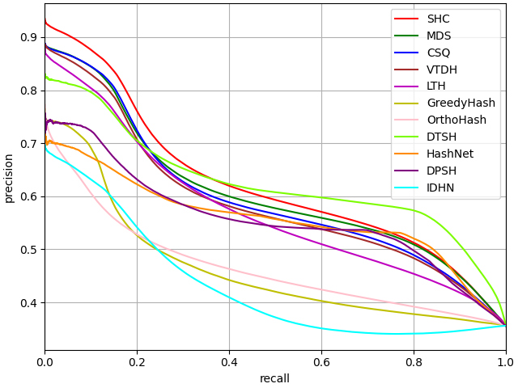 |
|:--------------------:|:--------------------:|:--------------------:|
|        16 bits, MSCOCO        |        32 bits, MSCOCO        |        64 bits, MSCOCO        |

More experimental results can be found in our original paper.

## Citation
If you find this repository useful, please consider citing our work:

```
Li Chen, Rui Liu, Yuxiang Zhou, Xudong Ma, Yong Chen (Corresponding), Dell Zhang (Corresponding). Deep Hashing with Semantic Hash Centers for Image Retrieval. ACM TRANSACTIONS ON INFORMATION SYSTEMS.

```

## Contact

For questions and further information about this research, please don't hesitate to contact us:

| Name | Email |
|------|-------|
| Li Chen | cc752424640@buaa.edu.cn |
| Yong Chen | yong.chen@bupt.edu.cn |

We welcome collaboration opportunities and are happy to provide additional details about our work.
