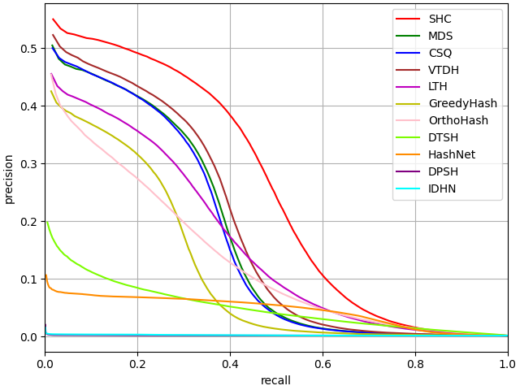

# Deep-Hashing-with-Semantic-Hash-Centers-for-Image-Retrieval
This this the source code for Deep Hashing with Semantic Hash Centers for Image Retrieval

# How to Run
My environment is
```
python==3.10.0
torchvision==0.16.2
pytorch==2.1.2
```

You can easily train and test SHC just by
```
python run.py
```

# Code Introduction
- `GenerateSimilarityMatrix.py` is stage1 in SHC, you can easily use it to generate SimilarityMatrix on your own dataset.
- `GenerateSemanticHashCenters.py` is stage2 in SHC, you can generate SemanticHashCenters based on SimilarityMatrix.
- `network.py` contains all the networks used in SHC, including classification network and hash network. The default is ResNet34. If you need to modify the backbone, you can do so here.

# Precision Recall Curve
the Precision Recall Curve in SHC is here:
|  |  |  |
|:--------------------:|:--------------------:|:--------------------:|
|        16 bits, CIFAR-100        |        32 bits, CIFAR-100        |        64 bits, CIFAR-100        |

|  |  |  |
|:--------------------:|:--------------------:|:--------------------:|
|        16 bits, Stanford Cars-A        |        32 bits, Stanford Cars-A        |        64 bits, Stanford Cars-A        |

|  |  |  |
|:--------------------:|:--------------------:|:--------------------:|
|        16 bits, Stanford Cars-B        |        32 bits, Stanford Cars-B        |        64 bits, Stanford Cars-B        |

|  |  |  |
|:--------------------:|:--------------------:|:--------------------:|
|        16 bits, NABirds-A        |        32 bits, NABirds-A        |        64 bits, NABirds-A        |

|  |  |  |
|:--------------------:|:--------------------:|:--------------------:|
|        16 bits, NABirds-B        |        32 bits, NABirds-B        |        64 bits, NABirds-B        |

|  |  |  |
|:--------------------:|:--------------------:|:--------------------:|
|        16 bits, MSCOCO        |        32 bits, MSCOCO        |        64 bits, MSCOCO        |

More experimental results can be found in our original paper.
